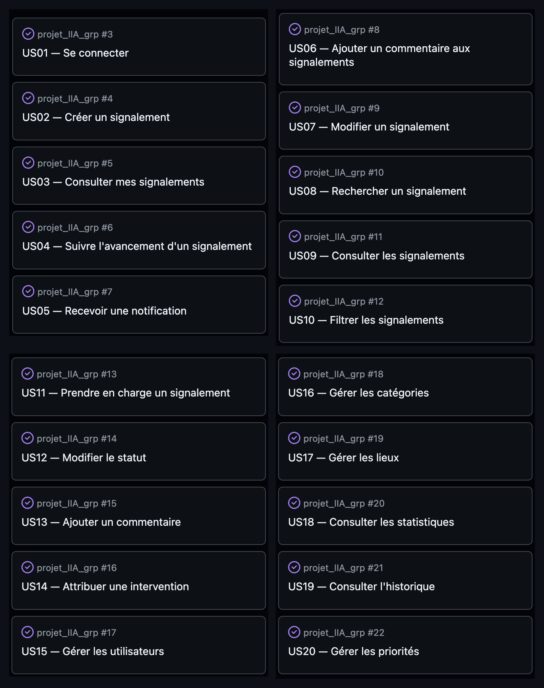

# Product Backlog — CampusHelp

Application de gestion des **signalements** pour les établissements scolaires.
Groupe 1 — Hadrien Cup, Oscar Beaugas, Kylian Dupuis, Inâs Tifaoui.
Dépôt : [Dkhallis/projet_IIA_grp](https://github.com/Dkhallis/projet_IIA_grp) · En production : https://projet-iia-grp.vercel.app/

---

## 1. Vision produit

CampusHelp permet aux **étudiants** de signaler un problème rencontré dans leur établissement (matériel en panne, Wi-Fi, salle, etc.), au **personnel** de le prendre en charge et de suivre son traitement, et à l'**administrateur** de gérer les référentiels (utilisateurs, catégories, lieux) et de consulter des statistiques.

Trois profils : 🧑‍🎓 **Étudiant** · 👨‍🏫 **Personnel** · 👨‍💼 **Administrateur**.

Statuts d'un signalement : `Nouveau` → `En cours` → `Résolu` (ou `Refusé`).

---

## 2. Definition of Ready (DoR)

Une User Story entre dans un sprint uniquement si :

- Elle respecte le format `En tant que… je veux… afin de…`.
- Ses critères d'acceptation sont définis et vérifiables.
- Elle est estimée en points (Planning Poker, suite de Fibonacci).
- Ses dépendances sont identifiées.
- Elle est assez petite pour tenir dans un seul sprint.
- Les écrans / composants concernés sont identifiés.

## 3. Definition of Done (DoD)

Une User Story est terminée quand :

- Le code est développé et poussé sur une branche.
- `npm run lint` (Oxlint) passe sans erreur.
- Tous les critères d'acceptation sont remplis.
- Le code a été relu par au moins un autre membre.
- La branche est mergée sur `main`.
- La documentation du sprint est à jour.

---

## 4. Estimation — Planning Poker (Fibonacci)

Suite utilisée : `1, 1, 2, 3, 5, 8, 13, 21`.

| US | Titre | Profil | Points | Sprint |
|------|-------|--------|:------:|:------:|
| US01 | Se connecter | 🧑‍🎓 Étudiant | 5 | S1 |
| US02 | Créer un signalement | 🧑‍🎓 Étudiant | 5 | S2 |
| US03 | Consulter mes signalements | 🧑‍🎓 Étudiant | 3 | S2 |
| US04 | Suivre l'avancement d'un signalement | 🧑‍🎓 Étudiant | 3 | S3 |
| US05 | Recevoir une notification | 🧑‍🎓 Étudiant | 5 | S3 |
| US06 | Ajouter un commentaire | 🧑‍🎓 Étudiant | 3 | S3 |
| US07 | Modifier un signalement | 🧑‍🎓 Étudiant | 3 | S3 |
| US08 | Rechercher un signalement | 🧑‍🎓 Étudiant | 5 | S3 |
| US09 | Consulter les signalements | 👨‍🏫 Personnel | 3 | S3 |
| US10 | Filtrer les signalements | 👨‍🏫 Personnel | 5 | S3 |
| US11 | Prendre en charge un signalement | 👨‍🏫 Personnel | 3 | S3 |
| US12 | Modifier le statut | 👨‍🏫 Personnel | 3 | S3 |
| US13 | Ajouter un commentaire (personnel) | 👨‍🏫 Personnel | 2 | S3 |
| US14 | Attribuer une intervention | 👨‍🏫 Personnel | 5 | S4 |
| US15 | Gérer les utilisateurs | 👨‍💼 Administrateur | 5 | S3 |
| US16 | Gérer les catégories | 👨‍💼 Administrateur | 3 | S3 |
| US17 | Gérer les lieux | 👨‍💼 Administrateur | 3 | S3 |
| US18 | Consulter les statistiques | 👨‍💼 Administrateur | 8 | S4 |
| US19 | Consulter l'historique | 👨‍💼 Administrateur | 3 | S4 |
| US20 | Gérer les priorités | 👨‍💼 Administrateur | 3 | S4 |

**Total : 80 points.**

### Product Backlog (User Stories — GitHub Issues)

---

## 5. Modèle de données (schéma Supabase)

Schéma PostgreSQL (`supabase/migrations/0001_init_schema.sql`) :

- `profiles` (id, nom, email, **role** : `etudiant` / `personnel` / `admin`, bloque, created_at)
- `categories` (id, nom)
- `lieux` (id, nom, batiment)
- `demandes` (id, titre, description, categorie_id, lieu_id, auteur_id, **statut** : `nouveau` / `en_cours` / `resolu` / `refuse`)
- `reports` (signalements remontés à la modération)

---

## 6. User Stories détaillées

### 🧑‍🎓 Étudiant

#### US01 — Se connecter · `5 pts`
> **En tant qu'** étudiant, **je veux** me connecter avec mon e-mail et mon mot de passe **afin d'**accéder à mon espace.

Critères d'acceptation :
- E-mail et mot de passe obligatoires ; champ vide bloque l'envoi.
- Format d'e-mail invalide → message d'erreur.
- Le mot de passe peut être affiché ou masqué.
- Connexion réussie → message de confirmation.

#### US02 — Créer un signalement · `5 pts`
> **En tant qu'** étudiant, **je veux** créer un signalement (titre, description, catégorie, lieu, photo optionnelle) **afin de** faire remonter un problème.

Critères d'acceptation :
- Titre, catégorie et lieu obligatoires.
- Statut initial `Nouveau`.
- Le signalement apparaît ensuite dans « mes signalements ».

#### US03 — Consulter mes signalements · `3 pts`
> **En tant qu'** étudiant, **je veux** consulter la liste de mes signalements **afin d'**en garder une vue d'ensemble.

Critères d'acceptation :
- Titre, catégorie, statut et date affichés.
- Message si la liste est vide.

#### US04 — Suivre l'avancement · `3 pts`
> **En tant qu'** étudiant, **je veux** suivre l'avancement de mon signalement **afin de** savoir où il en est.

Critères d'acceptation :
- Statut courant affiché clairement (`Nouveau`, `En cours`, `Résolu`, `Refusé`).
- Évolution du statut visible.

#### US05 — Recevoir une notification · `5 pts`
> **En tant qu'** étudiant, **je veux** être notifié quand mon signalement évolue **afin de** ne pas avoir à vérifier manuellement.

Critères d'acceptation :
- Notification générée à chaque changement de statut ou commentaire.
- Notifications non lues distinguées ; marquables comme lues.

#### US06 — Ajouter un commentaire · `3 pts`
> **En tant qu'** étudiant, **je veux** commenter mon signalement **afin d'**apporter des précisions.

Critères d'acceptation :
- Commentaire vide interdit.
- Auteur + date affichés.
- Tri chronologique.

#### US07 — Modifier un signalement · `3 pts`
> **En tant qu'** étudiant, **je veux** modifier un de mes signalements **afin de** corriger une information.

Critères d'acceptation :
- Seul l'auteur peut modifier.
- Modification impossible une fois le signalement pris en charge / résolu.

#### US08 — Rechercher un signalement · `5 pts`
> **En tant qu'** étudiant, **je veux** rechercher un signalement par mot-clé **afin de** le retrouver rapidement.

Critères d'acceptation :
- Recherche sur titre et description, insensible à la casse.
- Message si aucun résultat.

### 👨‍🏫 Personnel

#### US09 — Consulter les signalements · `3 pts`
> **En tant que** membre du personnel, **je veux** consulter tous les signalements **afin d'**avoir une vue globale.

Critères d'acceptation :
- Tous les signalements listés, avec auteur, catégorie, lieu, statut.

#### US10 — Filtrer les signalements · `5 pts`
> **En tant que** membre du personnel, **je veux** filtrer (catégorie, lieu, statut, date) **afin de** prioriser.

Critères d'acceptation :
- Filtres combinables ; mise à jour sans rechargement complet.
- Réinitialisation possible.

#### US11 — Prendre en charge · `3 pts`
> **En tant que** membre du personnel, **je veux** prendre en charge un signalement **afin d'**indiquer que je m'en occupe.

Critères d'acceptation :
- Passage au statut `En cours` + association du personnel.

#### US12 — Modifier le statut · `3 pts`
> **En tant que** membre du personnel, **je veux** changer le statut **afin de** refléter l'avancement.

Critères d'acceptation :
- Transitions logiques ; changement tracé.

#### US13 — Ajouter un commentaire · `2 pts`
> **En tant que** membre du personnel, **je veux** commenter un signalement **afin de** communiquer avec l'étudiant.

Critères d'acceptation :
- Commentaire visible par l'étudiant, avec auteur + date.

#### US14 — Attribuer une intervention · `5 pts`
> **En tant que** membre du personnel, **je veux** attribuer un signalement **afin de** répartir le travail.

Critères d'acceptation :
- Attribution à un membre du personnel, visible sur la fiche.

### 👨‍💼 Administrateur

#### US15 — Gérer les utilisateurs · `5 pts`
> **En tant qu'** administrateur, **je veux** gérer les comptes **afin de** contrôler les accès.

Critères d'acceptation :
- Lister, bloquer, supprimer un utilisateur ; changer son rôle.

#### US16 — Gérer les catégories · `3 pts`
> **En tant qu'** administrateur, **je veux** gérer les catégories **afin d'**adapter le référentiel.

Critères d'acceptation :
- Créer, renommer, supprimer une catégorie.

#### US17 — Gérer les lieux · `3 pts`
> **En tant qu'** administrateur, **je veux** gérer les lieux **afin de** refléter la structure de l'établissement.

Critères d'acceptation :
- Créer, modifier, supprimer un lieu (bâtiment / salle).

#### US18 — Consulter les statistiques · `8 pts`
> **En tant qu'** administrateur, **je veux** consulter des statistiques **afin de** piloter l'activité.

Critères d'acceptation :
- Nombre de signalements par statut, catégorie et lieu.

#### US19 — Consulter l'historique · `3 pts`
> **En tant qu'** administrateur, **je veux** consulter l'historique **afin d'**assurer la traçabilité.

Critères d'acceptation :
- Signalements clôturés consultables.

#### US20 — Gérer les priorités · `3 pts`
> **En tant qu'** administrateur, **je veux** définir la priorité d'un signalement **afin d'**organiser le traitement.

Critères d'acceptation :
- Niveaux `Basse` / `Moyenne` / `Haute`, exploitables par les filtres.
