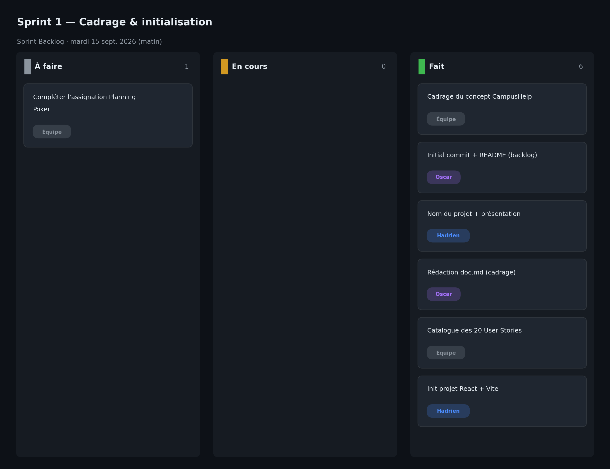

# Sprint 1 — Cadrage & initialisation

- **Date :** mardi 15 septembre 2026 (matin, 0,5 j)
- **Équipe :** Hadrien Cup, Oscar Beaugas, Kylian Dupuis, Inâs Tifaoui

## Sprint Goal

Définir le projet (concept, profils, backlog), initialiser le dépôt et le projet React, et rédiger la documentation de cadrage.

## Sprint Backlog

| # | Tâche | Responsable | Estimation | Statut |
|---|-------|-------------|:----------:|:------:|
| T1 | Choix et cadrage du concept CampusHelp | Équipe | 2 pts | ✅ |
| T2 | Initial commit + README (idées projet, backlog) | Oscar | 1 pt | ✅ |
| T3 | Nom du projet + présentation | Hadrien | 1 pt | ✅ |
| T4 | Rédaction du `doc.md` (contexte, backlog) | Oscar | 2 pts | ✅ |
| T5 | Catalogue des 20 User Stories | Équipe | 3 pts | ✅ |
| T6 | Initialisation du projet React + Vite | Hadrien | 3 pts | ✅ |

## Qui a fait quoi

- **Oscar Beaugas** — `Initial commit`, README avec les idées de projet et le backlog, rédaction de `doc.md`.
- **Hadrien Cup** — Choix du nom du projet, présentation, initialisation du projet React + Vite.
- **Kylian Dupuis** — Participation au cadrage : définition des profils et découpage initial des User Stories.
- **Inâs Tifaoui** — Rédaction et mise en forme de toute la documentation du projet (structure, fichiers de sprint, Product Backlog).

## Tâches terminées

- Concept CampusHelp validé (signalement et suivi de problèmes dans l'établissement).
- Trois profils définis et 20 User Stories cataloguées.
- Dépôt initialisé, projet React + Vite en place.
- Documentation de cadrage rédigée.

## Tâches non terminées

- Aucune brique fonctionnelle livrée à ce stade (sprint de cadrage).
- Assignation formelle du Planning Poker à compléter.

## Problèmes rencontrés

- Vocabulaire hésitant entre « demandes d'aide » et « signalements » — à homogénéiser.
- Périmètre large (20 US) à cadrer dans une demi-journée.

## Décisions prises

- Nom et concept retenus : CampusHelp, application de signalement.
- Front en React + Vite ; base de données en Supabase (PostgreSQL).
- Découpage du travail en 4 sprints sur mardi et mercredi.

## Comptes rendus des Daily Scrum

**Daily — 11h20**
- Fait : dépôt créé, premières idées de projet dans le README.
- À faire : figer le concept, initialiser React, rédiger le doc de cadrage.
- Blocages : choix du périmètre.

**Daily — 12h15**
- Fait : concept CampusHelp validé, présentation rédigée.
- À faire : catalogue des 20 US, `doc.md`.
- Blocages : terminologie demandes/signalements à trancher.

**Daily — 13h15**
- Fait : `doc.md` et catalogue des US rédigés, projet React initialisé.
- À faire : première brique fonctionnelle au sprint suivant.
- Blocages : aucun.

## Sprint Review

Présentation du cadrage : concept, profils, 20 User Stories et projet React prêt à recevoir du code. Aucune fonctionnalité livrée, ce qui est cohérent avec un sprint de cadrage. Base posée pour le développement.

## Sprint Retrospective (Keep / Drop / Try)

| Keep | Drop | Try |
|------|------|-----|
| Le cadrage écrit dès le début | Le flou terminologique demandes/signalements | Fixer un vocabulaire unique dès maintenant |
| Le catalogue complet des 20 US | Trop de commits de mise au point sur la doc | Regrouper les modifications avant de pousser |
| La répartition claire des profils | — | Livrer une brique fonctionnelle dès le sprint 2 |
