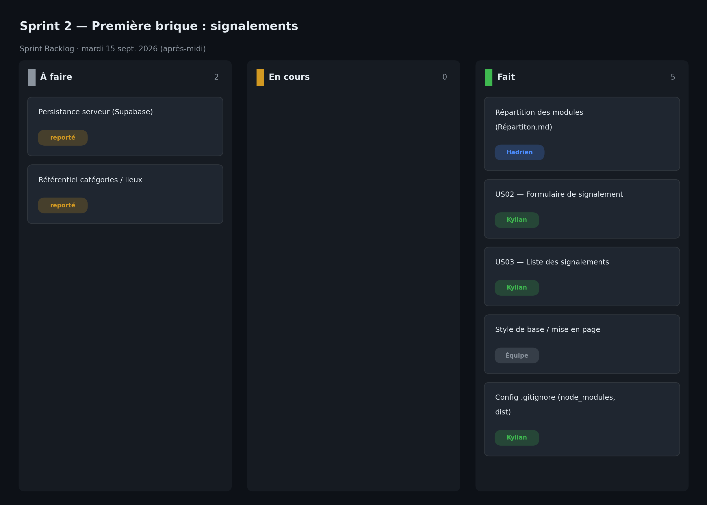

# Sprint 2 — Première brique : signalements

- **Date :** mardi 15 septembre 2026 (après-midi, 0,5 j)
- **Équipe :** Hadrien Cup, Oscar Beaugas, Kylian Dupuis, Inâs Tifaoui

## Sprint Goal

Livrer la première brique fonctionnelle : créer un signalement et consulter la liste des signalements (persistance en mémoire / `localStorage`, sans backend à ce stade).

## Sprint Backlog

| # | Tâche | US | Responsable | Estimation | Statut |
|---|-------|----|-------------|:----------:|:------:|
| T1 | Répartition détaillée des modules (`Répartiton.md`) | — | Hadrien | 2 pts | ✅ |
| T2 | Formulaire de signalement (titre, description, catégorie, lieu, photo) | US02 | Kylian | 5 pts | ✅ |
| T3 | Liste des signalements | US03 | Kylian | 3 pts | ✅ |
| T4 | Style de base / mise en page | — | Équipe | 2 pts | ✅ |
| T5 | Exclusion de `node_modules` / `dist` du suivi Git | — | Kylian | 1 pt | ✅ |

## Qui a fait quoi

- **Hadrien Cup** — Rédaction de la répartition détaillée des tâches par personne (`Répartiton.md`).
- **Kylian Dupuis** — Développement du formulaire de signalement et de la liste associée, configuration du `.gitignore`.
- **Oscar Beaugas** — Ajout de fichiers de base au dépôt.
- **Inâs Tifaoui** — Contribution au style / à la mise en page et rédaction de la documentation du sprint.

## Tâches terminées

- **US02 — Créer un signalement** : formulaire complet (titre, description, catégorie, lieu, photo optionnelle), statut initial `Nouveau`.
- **US03 — Consulter mes signalements** : liste affichée, persistée en `localStorage`.
- Répartition des modules formalisée entre les 4 membres.

## Tâches non terminées

- Persistance serveur : les signalements vivent en `localStorage`, la base Supabase n'est pas encore branchée.
- Catégories et lieux codés en dur, faute de référentiel administrable.

## Problèmes rencontrés

- Démarrage sans backend pour livrer vite une brique visible → dette technique de persistance à rembourser.
- Le module se construit autour du vocabulaire « demandes » avant d'être renommé « signalements ».

## Décisions prises

- Livrer la brique signalement en `localStorage` pour ne pas bloquer le front.
- Répartir explicitement les 4 modules : Connexion (Hadrien), Signalements (Kylian), Messagerie/Notifications (Inâs), Recherche/Admin/BDD (Oscar).
- Chacun travaille sur sa propre branche.

## Comptes rendus des Daily Scrum

**Daily — 14h15**
- Fait : répartition des modules rédigée.
- À faire : formulaire de signalement + liste.
- Blocages : aucun.

**Daily — 15h15**
- Fait : formulaire de signalement en place.
- À faire : finaliser la liste, styliser, `.gitignore`.
- Blocages : structure des données à figer.

**Daily — 16h30**
- Fait : création + liste des signalements fonctionnelles.
- À faire : développement cœur multi-profils au sprint 3.
- Blocages : persistance serveur repoussée.

## Sprint Review

Démonstration de la création d'un signalement et de son apparition dans la liste. US02 et US03 validées côté front. La persistance reste locale, à brancher sur Supabase plus tard.

## Sprint Retrospective (Keep / Drop / Try)

| Keep | Drop | Try |
|------|------|-----|
| Livrer vite une brique visible | Coder catégories/lieux en dur | Brancher Supabase avant que la dette grossisse |
| La répartition claire par module | Le double vocabulaire demandes/signalements | Uniformiser les noms dans le code |
| Le `.gitignore` propre dès le début | — | Se coordonner sur la structure des données |
