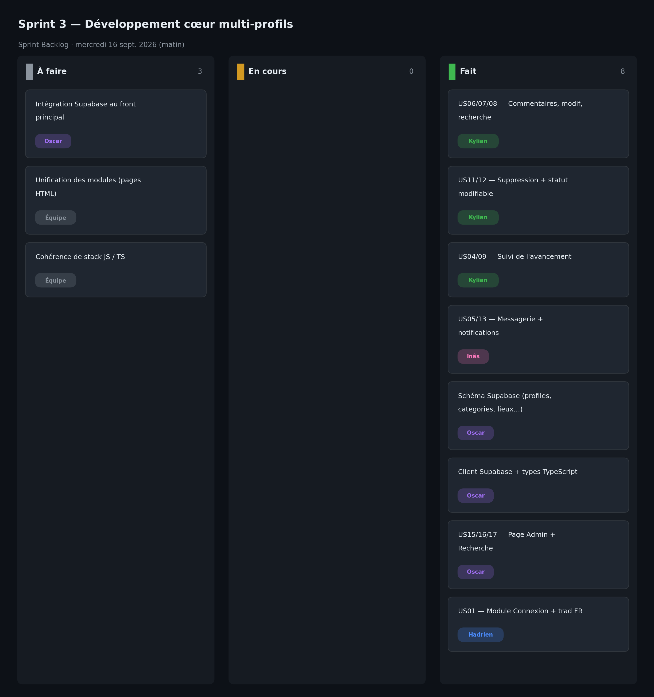

# Sprint 3 — Développement cœur multi-profils

- **Date :** mercredi 16 septembre 2026 (matin, 0,5 j)
- **Équipe :** Hadrien Cup, Oscar Beaugas, Kylian Dupuis, Inâs Tifaoui

## Sprint Goal

Développer le cœur fonctionnel sur les 3 profils : interactions sur les signalements (étudiant), traitement (personnel), et poser la base de données Supabase avec les écrans admin et recherche.

## Sprint Backlog

| # | Tâche | US | Responsable | Statut |
|---|-------|----|-------------|:------:|
| T1 | Recherche, modification et commentaires sur signalements | US06, US07, US08 | Kylian | ✅ |
| T2 | Suppression + statut modifiable | US11, US12 | Kylian | ✅ |
| T3 | Suivi de l'avancement (statuts) | US04, US09 | Kylian | ✅ |
| T4 | Messagerie + notifications | US05, US13 | Inâs | ✅ |
| T5 | Schéma Supabase (profiles, categories, lieux, demandes, reports) | — | Oscar | ✅ |
| T6 | Client Supabase + types TypeScript | — | Oscar | ✅ |
| T7 | Fonctions + page Administration et Recherche | US15, US16, US17 | Oscar | ✅ |
| T8 | Module Connexion et Utilisateurs + traduction FR | US01 | Hadrien | ✅ |

## Qui a fait quoi

- **Kylian Dupuis** — Recherche, modification et commentaires sur les signalements ; suppression + statut modifiable ; correction d'affichage.
- **Inâs Tifaoui** — Ajout de la messagerie et des notifications (`messages.html`, `conversation.html`, `notifications.html`, `js/messages.js`, `js/notifications.js`) et rédaction de la documentation du sprint.
- **Oscar Beaugas** — Schéma Supabase (`0001_init_schema.sql`), client Supabase + types TypeScript, fonctions admin (`getUsers`, `deleteUser`, `blockUser`, `getReports`, `deleteDemandeAdmin`) et recherche (`searchDemandes`, `filterByCategory/Location/Date`), pages `AdminPage.tsx` et `SearchPage.tsx`.
- **Hadrien Cup** — Intégration du module Connexion et Utilisateurs, traduction de la documentation en français.

## Tâches terminées

- **US06, US07, US08** : commentaires, modification, recherche de signalements.
- **US04, US09, US11, US12** : suivi de l'avancement, consultation, prise en charge et changement de statut.
- **US05, US13** : messagerie et notifications.
- **US01** : module connexion / utilisateurs.
- **US15, US16, US17** : schéma Supabase, fonctions et pages admin/recherche.

## Tâches non terminées

- Intégration du module Supabase (schéma, client, hooks, pages `AdminPage.tsx` / `SearchPage.tsx`) dans l'application React principale, qui tourne encore en `localStorage`.
- Unification des modules : la messagerie/notifications (pages HTML/JS) et le module connexion ne sont pas encore fondus dans une seule application React.
- Cohérence de stack : coexistence de JavaScript (`.jsx`) et de TypeScript (`.ts/.tsx`).

## Problèmes rencontrés

- Travail en parallèle sur 4 branches → l'intégration devient le principal chantier.
- Deux approches cohabitent (application React vs pages HTML/JS autonomes, JS vs TS).
- La base Supabase existe mais n'est pas encore reliée aux écrans du front principal.

## Décisions prises

- Chaque membre finalise son module sur sa branche, assemblage prévu au sprint 4.
- Rédaction de notes d'intégration pour cadrer l'assemblage final.
- Conserver `localStorage` comme persistance tant que Supabase n'est pas branché, pour garder une démo fonctionnelle.

## Comptes rendus des Daily Scrum

**Daily — 08h55**
- Fait : démarrage des modules sur les branches.
- À faire : schéma BDD + admin, features signalements, messagerie, connexion.
- Blocages : aucun.

**Daily — 09h50**
- Fait : schéma Supabase + fonctions admin/recherche, recherche/commentaires, messagerie.
- À faire : statut modifiable, connexion, notes d'intégration.
- Blocages : brancher le TypeScript/Supabase sur l'application JS.

**Daily — 10h45**
- Fait : suppression + statut, module connexion, doc traduite.
- À faire : préparer l'assemblage vers `main`.
- Blocages : intégration inter-branches à planifier.

## Sprint Review

Présentation module par module : signalements enrichis (recherche, modification, commentaires, statut), messagerie/notifications, connexion, base Supabase et écrans admin/recherche. La majorité des User Stories est développée, répartie sur plusieurs branches ; l'intégration reste à faire.

## Sprint Retrospective (Keep / Drop / Try)

| Keep | Drop | Try |
|------|------|-----|
| Le parallélisme efficace sur 4 branches | Laisser diverger les stacks (JS vs TS) | Intégrer au fil de l'eau plutôt qu'à la fin |
| Les notes d'intégration | Repousser tout l'assemblage au dernier sprint | Fixer une cible technique unique |
| La couverture large des US | Les pages autonomes non reliées à l'app | Merger tôt sur `main` pour tester l'ensemble |
