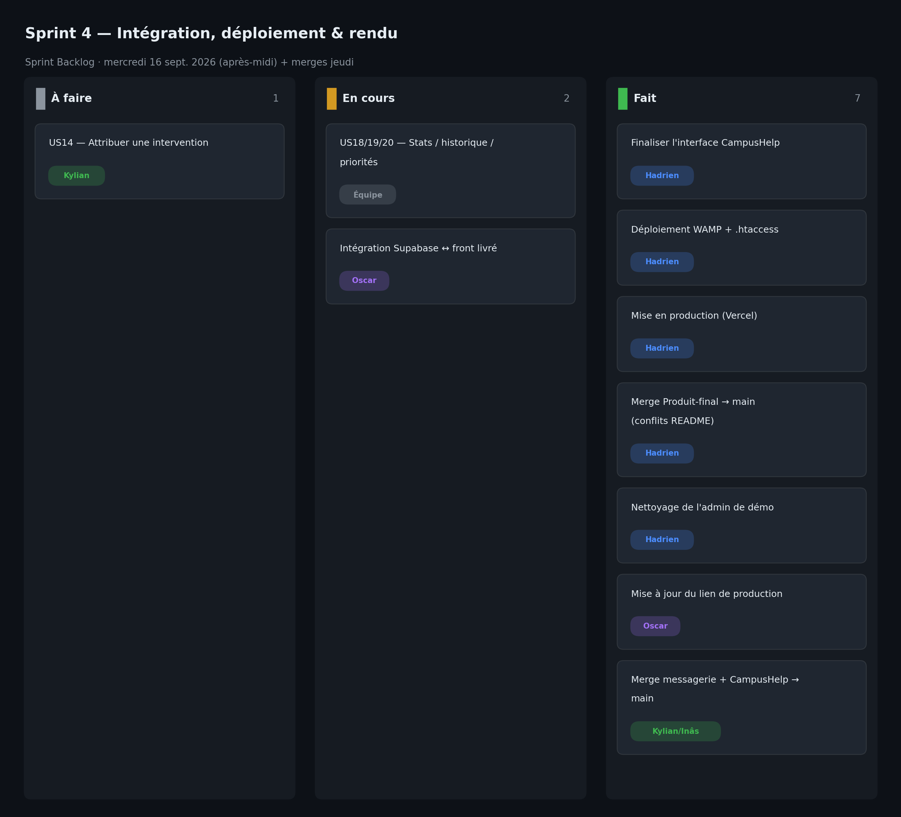

# Sprint 4 — Intégration, déploiement & rendu

- **Date :** mercredi 16 septembre 2026 (après-midi, 0,5 j) + merges finaux jeudi 17 au matin
- **Équipe :** Hadrien Cup, Oscar Beaugas, Kylian Dupuis, Inâs Tifaoui

## Sprint Goal

Assembler les modules sur `main`, finaliser l'interface, déployer l'application en public et préparer le rendu.

## Sprint Backlog

| # | Tâche | Responsable | Estimation | Statut |
|---|-------|-------------|:----------:|:------:|
| T1 | Finaliser l'interface CampusHelp | Hadrien | 3 pts | ✅ |
| T2 | Déploiement WAMP + `.htaccess` | Hadrien | 2 pts | ✅ |
| T3 | Mise en production publique (Vercel) | Hadrien | 2 pts | ✅ |
| T4 | Merge de `Produit-final` dans `main` + conflits README | Hadrien | 3 pts | ✅ |
| T5 | Remplacement de l'admin de démo par `ADMINISTRATEUR` | Hadrien | 1 pt | ✅ |
| T6 | Mise à jour du lien de production | Oscar | 1 pt | ✅ |
| T7 | Merge des branches `messagerie-et-notifications` et `CampusHelp` sur `main` | Kylian, Inâs | 3 pts | ✅ |
| T8 | Intégration complète de Supabase au front principal | Oscar | 5 pts | ⏳ |
| T9 | Statistiques / historique / priorités (US18, US19, US20) | Équipe | 14 pts | ⏳ |

## Qui a fait quoi

- **Hadrien Cup** — Finalisation de l'interface, déploiement WAMP + `.htaccess`, mise en production sur Vercel, merge de `Produit-final` dans `main` avec résolution des conflits README, remplacement de l'administrateur de démo par `ADMINISTRATEUR`.
- **Oscar Beaugas** — Mise à jour du lien de production ; module Supabase/admin à intégrer depuis sa branche.
- **Kylian Dupuis** — Merge de la branche `CampusHelp` sur `main`.
- **Inâs Tifaoui** — Merge de `main` dans `messagerie-et-notifications` et rédaction de la documentation du sprint et du bilan de projet.

## Tâches terminées

- Interface finalisée et application fonctionnelle.
- Déploiement public sur Vercel : https://projet-iia-grp.vercel.app/
- Déploiement local WAMP + `.htaccess` opérationnel.
- Toutes les branches mergées sur `main` (`Produit-final`, `CampusHelp`, `messagerie-et-notifications`).
- Nettoyage des données de démo.

## Tâches non terminées

- Intégration de Supabase au front principal : l'application déployée fonctionne en `localStorage` ; le schéma et les écrans admin/recherche (TypeScript) ne sont pas branchés à l'application React livrée.
- Unification totale des modules (messagerie/notifications en pages HTML/JS, module connexion).
- US18 (statistiques), US19 (historique), US20 (priorités) : conçues mais non finalisées dans l'app livrée.
- US14 (attribution d'intervention) : amorcée, non terminée.
- Cohérence de stack JS / TS.

## Problèmes rencontrés

- L'intégration a été le principal goulot d'étranglement : assembler 4 branches aux approches différentes (application React + pages HTML autonomes, JS + TS, localStorage + Supabase) a pris le temps prévu pour finaliser les écrans admin.
- Conflits Git au merge de `Produit-final` (README notamment), résolus manuellement.
- Merges finaux réalisés jeudi matin, juste avant le rendu.
- Écart entre la stack annoncée dans le README (TypeScript + Supabase) et la stack effectivement déployée (JavaScript + localStorage).

## Décisions prises

- Prioriser un produit déployé et démontrable (Vercel, localStorage) plutôt qu'une intégration Supabase incomplète avant le rendu.
- Tout merger sur `main`, y compris les modules de chacun.
- Documenter l'intégration Supabase comme chantier restant.
- Reporter statistiques/historique/priorités et l'attribution d'intervention.

## Comptes rendus des Daily Scrum

**Daily — 14h10**
- Fait : interface en cours de finalisation, WAMP configuré.
- À faire : déployer en public, merger les branches sur `main`.
- Blocages : intégration Supabase lourde.

**Daily — 15h15**
- Fait : déploiement Vercel en ligne, lien de production documenté.
- À faire : merge `Produit-final`, résoudre les conflits README.
- Blocages : conflits Git à résoudre.

**Daily — 16h30**
- Fait : `Produit-final` mergé sur `main`, admin de démo nettoyé.
- À faire : merges finaux des branches restantes.
- Blocages : Supabase non intégrable dans le temps restant.

**Daily — jeudi 17, 09h45**
- Fait : merge de `messagerie-et-notifications` et `CampusHelp` sur `main`.
- À faire : vérifier `main`, envoyer le rendu.
- Blocages : aucun.

## Sprint Review

Présentation de l'application en ligne sur Vercel : connexion, création/consultation/recherche/modification/commentaires de signalements, changement de statut, messagerie/notifications. La base Supabase et les écrans admin existent mais ne sont pas branchés à l'app livrée. Produit déployé et mergé sur `main`, avec un chantier d'intégration identifié.

## Sprint Retrospective (Keep / Drop / Try)

| Keep | Drop | Try |
|------|------|-----|
| Le déploiement public livré (Vercel) | Repousser toute l'intégration au dernier sprint | Intégrer en continu tout au long des sprints |
| Le merge complet sur `main` | Laisser diverger annonce README et stack réelle | Aligner la doc sur ce qui est déployé |
| La couverture fonctionnelle large | Les merges de dernière minute | Figer une seule cible technique dès le sprint 2 |

## Bilan de fin de projet

- **Livré et en ligne (Vercel) :** connexion, signalements (création, liste, recherche, modification, commentaires, statut), messagerie/notifications — persistance `localStorage`.
- **Développé mais non intégré :** base Supabase et écrans admin/recherche (TypeScript).
- **Partiel / à finir :** intégration Supabase ↔ front, unification des modules, statistiques, historique, priorités, attribution d'intervention, cohérence JS/TS.
- **Hébergement public :** en ligne sur Vercel.
- **Merge :** toutes les branches consolidées sur `main`.
